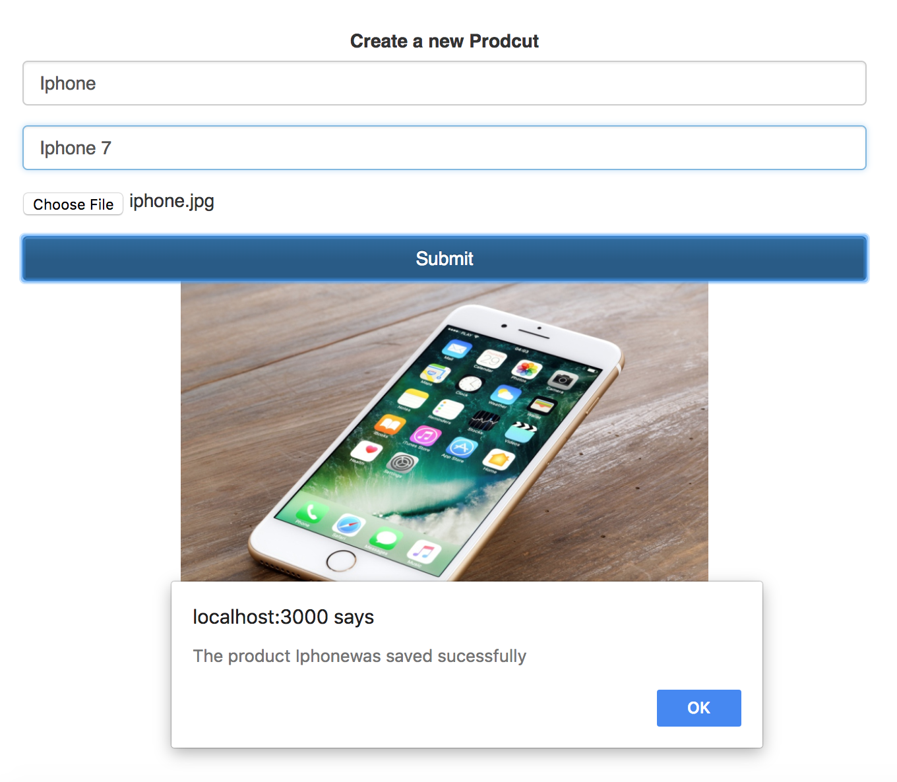
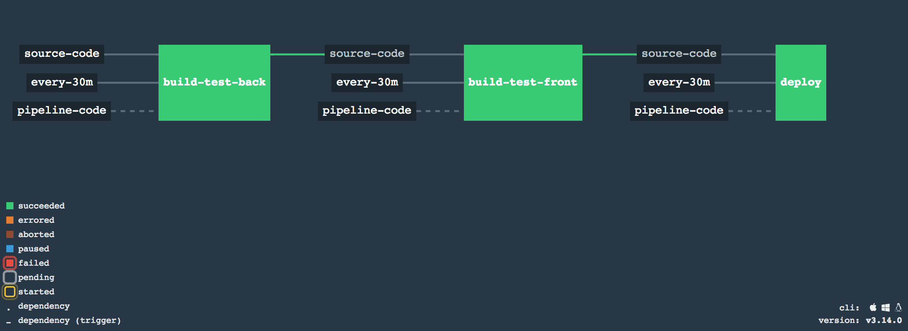

# Dotsub

#### Description

The following is an example for create a new stock product



#### Requirements

To build the following pipeline is required

- [x] Docker
- [x] Docker compose

#### Install concourse

```
wget https://concourse-ci.org/docker-compose.yml
docker-compose up -d
```

#### Install fly

Install the `fly` binary. The following is a OS example:

```
curl -Lo fly https://github.com/concourse/concourse/releases/download/v2.5.0/fly_darwin_amd64 && chmod +x fly && mv fly /usr/local/bin/
```

#### Concourse target

```
fly --target dotsub login --concourse-url http://127.0.0.1:8080
fly --target dotsub sync
```

### Run dev-pipeline

```
git clone https://github.com/cristianchaparroa/dotsub.git
cd dotsub/
fly -t dotsub set-pipeline -c concourse/dev/dotsub.yml -p dev-pipeline
```


You can check the pipeline state in the following url:

```
 http://127.0.0.1:8080/teams/main/pipelines/dev-pipeline
```

#### Dev Pipeline composition

The current dev pipeline is composite by:
- [x] **build-test-back**: build the spring application including test
- [x] **build-test-front**: build the simple reactjs application including tests.
- [ ] **deploy**:  Deploy the sources to cloud-foundry/Amazon and have a dev environment alive.

Each job runs automatically each 30 mins.



### TODOS
- [ ] Add more test in back and frontend
- [ ] Add database implementation and respective repositories
- [ ] Add another service to list the sources uploaded
- [ ] Add form validations
- [ ] Add Java documentation
- [ ] Add API Rest documentation
- [ ] Complete the dev pipe line to deploy automatically the application on  cloud-foundry/Amazon/digital ocean or specific server.
- [ ] Setup multiples environments
